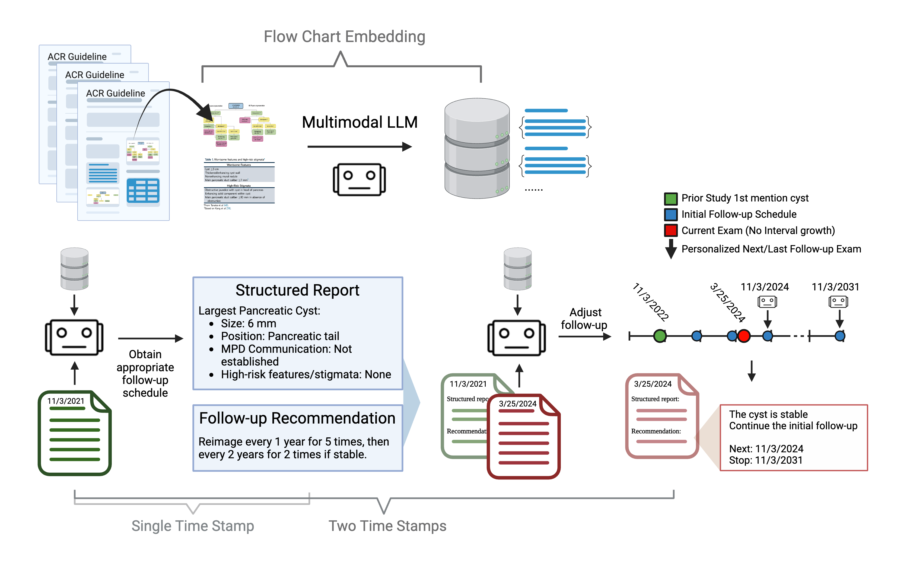
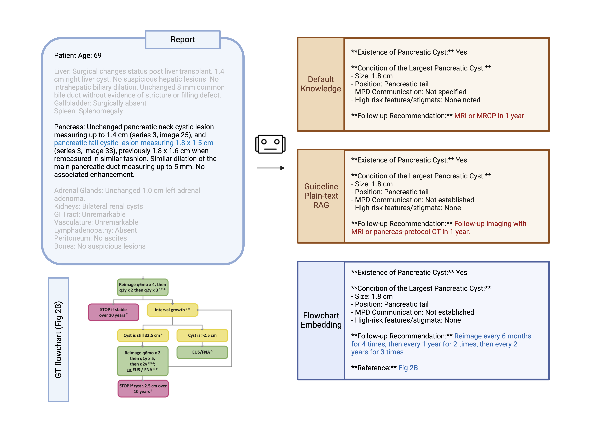
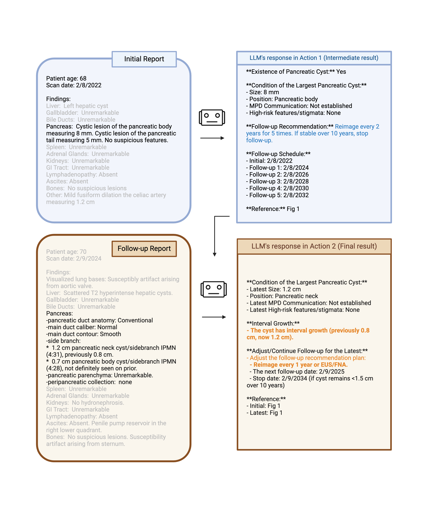

# Automated Personalized Pancreatic Cystic Lesion Management: A Multimodal Large Language Model Approach with Dynamic-Knowledge Retrieval  

Pipeline overview:
 

 
 
Single-time point report example:
 

 
 
Multi-time point reports example:
 

 
