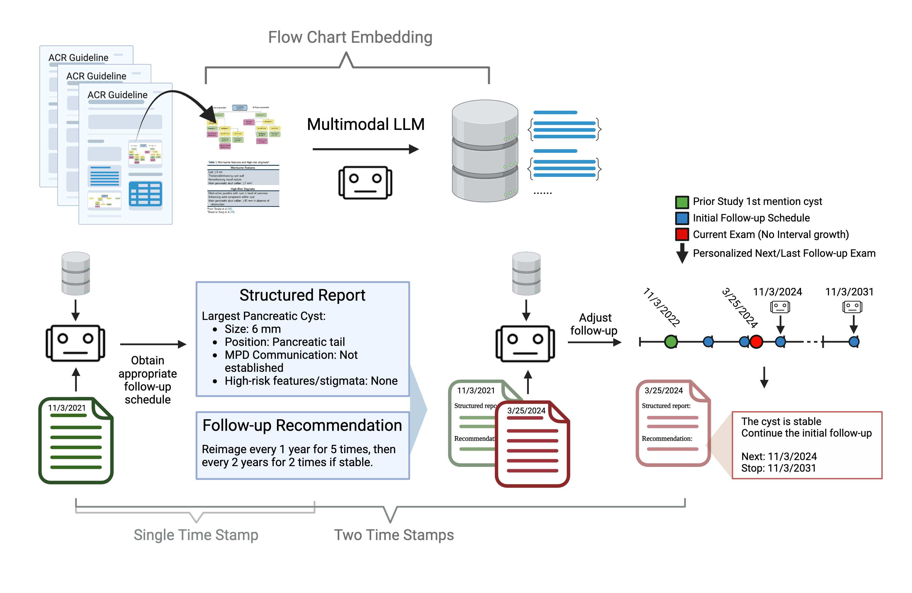
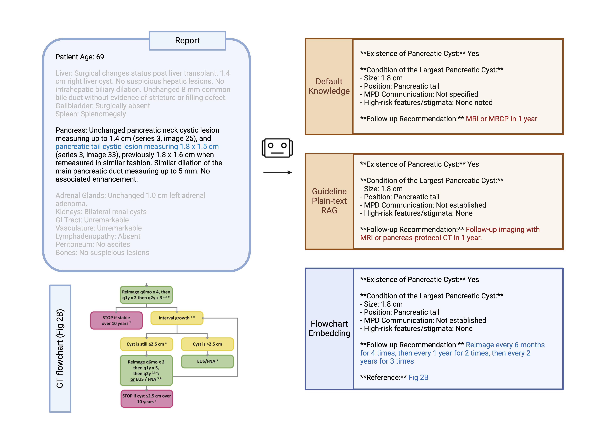
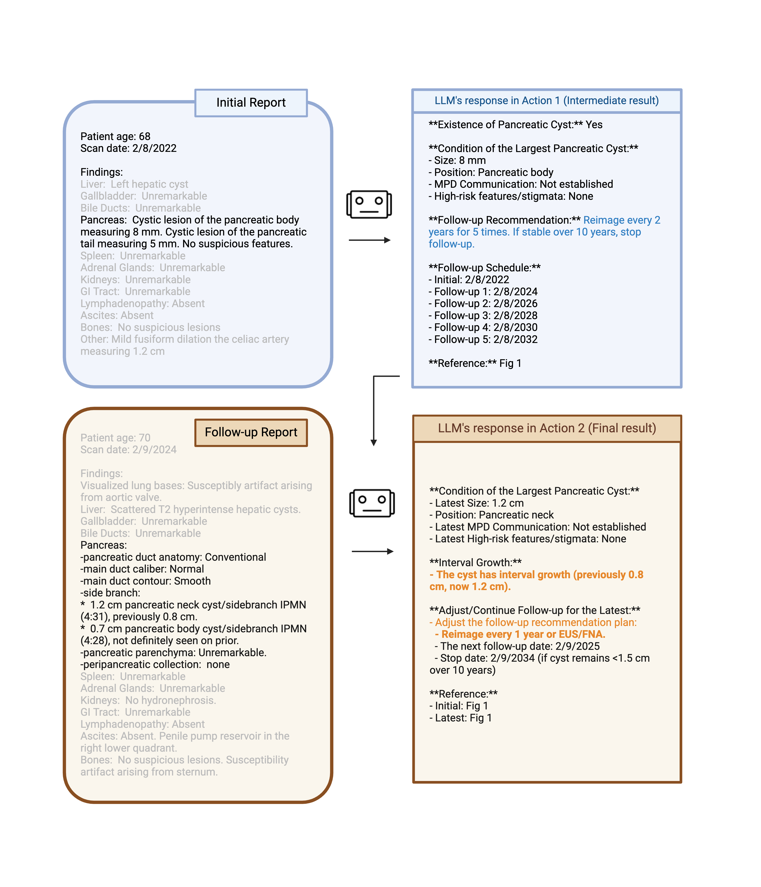

# Multimodal Large Language Model With Knowledge Retrieval Using Flowchart Embedding for Forming Follow-Up Recommendations for Pancreatic Cystic Lesions  

Publication: https://ajronline.org/doi/abs/10.2214/ajr.25.32729

Pipeline overview:
 

 
 
Single-time point report example:
 

 
 
Multi-time point reports example:
 

 
